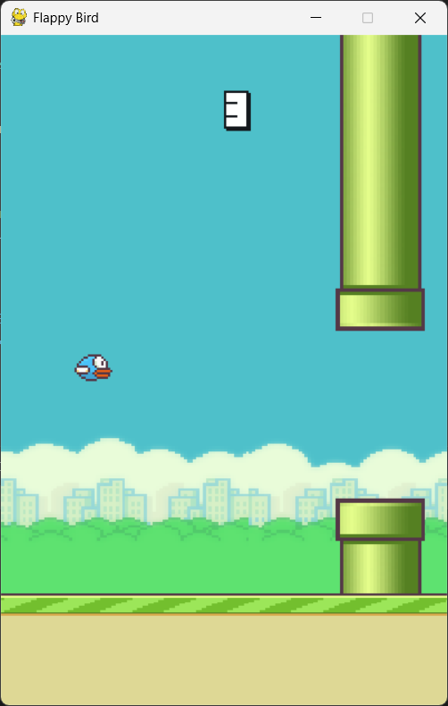

# 🐦 FlappyBird-Pygame

An interactive and customizable version of the classic Flappy Bird game built using Python and the Pygame library. Developed as part of my **Advanced Python Technologies** course project (3rd Semester).

---

## 🎯 Features

- 🔄 **Dynamic Map Selection**: Choose from Classic Day, Night, Forest, Snow, Cave, and more.
- 🎮 **Difficulty Levels**: Easy, Normal, Hard — dynamically adjusts gap sizes and pipe speed.
- 📊 **High Score System**: Automatically tracks and saves high scores (`high_scores.csv`).
- 🐦 **Animated Bird Sprites**: Smooth flap animation and gravity mechanics.
- 📁 **Modular Code**: Cleanly separated into `main_game.py` and `map_selection.py`.
- 📸 **Custom UI**: Start screen, score board, game over screen, hover/click map selection.
- 🗃️ **Persistent Data**: Scores and game session logs saved (`student_data.csv`).
- 🧪 **Responsive Collision Detection** and smooth gameplay feel.

---

## 🖼️ Screenshots


<p align="left">
  <br>
  <em>Start Screen – choose difficulty and map</em>
</p>

<p align="left">
  <br>
  <em>Gameplay – animated sprites and pipe obstacles</em>
</p>

<p align="left">
  <br>
  <em>Map Selection – hoverable and clickable map themes</em>
</p>

---

## 🚀 How to Run

### 1. Clone the repo

```bash
git clone https://github.com/udaykumar0515/FlappyBird-Pygame
cd FlappyBird-Pygame
```

### 2. Install dependencies

Make sure you have `pygame` installed:

```bash
pip install pygame
```

### 3. Run the game

```bash
python main_game.py
```

---

## 🗂️ Folder Structure

```
FlappyBird-Pygame/
├── assets/
│   ├── audio/         
│   └── sprites/       
├── screenshots/       
├── main_game.py       
├── map_selection.py   
├── high_scores.csv   
├── player_data.csv 
├── selected_map.json  
└── README.md
```

---

## 💡 Future Improvements

* Add sound/music toggle options  
* More birds with different abilities  
* Add local multiplayer mode  
* Leaderboard using SQLite or Firebase  

---

## 👥 Contributors

| Name           | GitHub                                      |
|----------------|---------------------------------------------|
| Udaykumar H.   | [@udaykumar0515](https://github.com/udaykumar0515) |
| Pranay         | [@pranaysmiley](https://github.com/pranaysmiley)   |
| Madhan         | N/A                                         |

---


## 🏁 Project Status

✅ Complete, playable  

---
